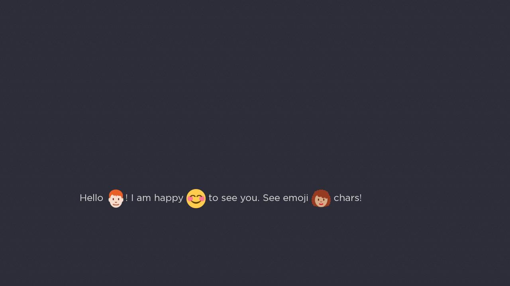
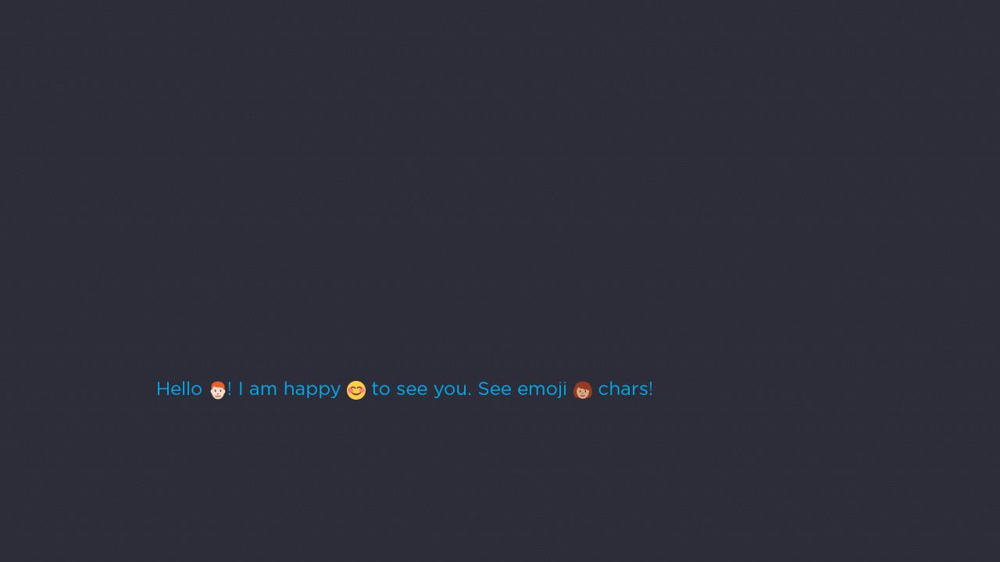

# Emoji On Roku
This project is a port of the Twitter Emoji Project, [Twemoji](https://twemoji.twitter.com/). 
The aim of this project is to provide Emoji support on Roku using scenegraph and brightscript.

## Installation

Download the zip containing the source, and unzip the source files. 
Place the source and components directories inside your project, in the same
folder. 

Alternativly, use component libraries to install the EmojiOnRoku project. 
See the component library documentation here: 
https://developer.roku.com/docs/references/scenegraph/control-nodes/componentlibrary.md.

Also check the releases page on this Github repository for the correct url for the component 
library. Checkout the demo project for a working example. 

## Usage

To use emoji in your project, create an `EmojiLabel` and set its `text` property to a string 
containing emojis:
**Code:**
```brightscript
myEmojiLabel = createObject("roSGNode", "EmojiLabel")
myEmojiLabel.text = "Hello 👨🏻‍🦰! I am happy 😊 to see you. See emoji 👩🏽‍🦱 chars!"
myEmojilabel.translation=[200, 500]
m.top.appendChild(myEmojiLabel)
```

**Result**:



You can also set the color, font, height, and other properties like you would on an ordinary 
Scenegraph `Label` node. The emojis are shown at 
72x72 size unless you specify the height or emojiSize
properties:
**Code:**
```brightscript
myEmojiLabel.height = 24
myEmojiLabel.color = &h00AAEEFF
```
**Result:**



Finally, aligment can also be used, just as for normal Scenegraph `Label` nodes as well. 
Here are all `horizAlign` and `vertAlign` combinations for the same `EmojiLabel`, who
has a width and height set to the fullscreen size.

Note that it is recommended to use `center` for `vertAlign` (the defualt), since this will align the emojis
relative to the text labels as well. 
**Code:**
```brightscript
myEmojiLabel.width = 1920
myEmojiLabel.height = 1080
myEmojiLabel.horizAlign = "left" ' or "center" or "right"
myEmojiLabel.vertAlign = "top" ' or "center" or "bottom"
myEmojiLabel.color = &h00AAEEFF
```
**Result:**


Note that it is recommended to set an explicit width on labels before using `"center"` or `"right"` for `horizAlign`. 

When setting an explicit width, if the width of the label/emojis go over that width, the labels will use an ellipsis. 
If the cutoff is in the middle of an emoji, however, the emoji will not be replaced by an ellipsis.

## License
Copyright 2020 Kasper Gammeltoft
Code licensed under the MIT License: http://opensource.org/licenses/MIT
